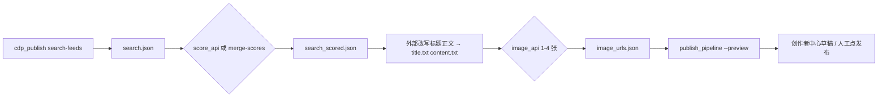

# AI 编排工作流（外部打分 + 外部生图 + 创作者草稿）

本仓库的 **小红书自动化**（登录、检索、填表、发布）仍由 `cdp_publish.py` / `publish_pipeline.py` 完成；**打分、改写正文、生图** 由你在 `config/external_ai.json` 中配置的 HTTP API 或手工 JSON 完成，避免把第三方密钥写进脚本。

## 是否影响原有逻辑？

- **不影响**：未调用 `ai_content_pipeline.py` 时，原有命令与行为不变。
- **可选加强**：`publish_pipeline.py` 新增 `--strict-image-downloads`，仅在显式传入时启用（任意一张图下载失败即退出）。

## 数据流概览



## `search-feeds` 结果块

`cdp_publish.py` 在标准输出中打印：

```text
SEARCH_FEEDS_RESULT:
{ ... JSON ... }
```

`ai_content_pipeline.py fetch-search` 会解析该 JSON 并写入文件。顶层字段包含 `keyword`、`recommended_keywords`、`feeds` 等。

## 打分合并：`merge-scores` 文件格式

准备一个 JSON 文件（由你的 Agent/后端生成），示例：

```json
{
  "feed_scores": [
    {
      "index": 0,
      "score": 8.5,
      "labels": ["信息密度高", "结构清晰"],
      "reason": "要点分条，适合改编为清单体"
    }
  ]
}
```

脚本会把对应项写入 `feeds[i]` 的字段：

- `ai_score`
- `ai_labels`
- `ai_reason`

也可按笔记 id 匹配（若 feed 对象中存在 `id` 或 `noteCard.noteId` 等，见脚本内 `_feed_id_candidates`）。

## 外部打分 API 约定（`score-api`）

当 `config/external_ai.json` 中 `score_api.enabled` 为 `true` 且填写了 `url` 时，`score-api` 子命令会 POST JSON：

- 默认 body：`{"search": <search.json 全文>}`
- 若配置了 `request_wrap.envelope_key` 为 `payload`，则 body 为 `{"payload": <search.json 全文>}`

**期望响应**（任选一种，脚本会尽量兼容）：

1. 与 `search.json` 同结构，且 `feeds` 中每条已带 `ai_score` / `ai_labels` / `ai_reason`；
2. `{ "feed_scores": [ { "index": 0, "score": 8, "labels": [], "reason": "" } ] }`；
3. `{ "feeds": [ ... 完整替换列表 ... ] }`。

## 外部生图 API 约定（`image-api`）

- `image_count` 范围：**1～4**（CLI `--count`）。
- 请求体字段名由 `image_api.body.prompt_field` / `count_field` 指定（默认 `prompt`、`n`），并与 `image_api.body.extra` 合并。

**期望响应**：JSON 内出现字符串 URL 列表，脚本按以下顺序尝试解析：

- 顶层键：`image_urls`、`urls`、`data`（若为列表）
- 递归查找：第一个「元素均为 `http` 开头的字符串」的数组

## 保存草稿

使用现有发布流水线，**只填充不点发布**：

```bash
python scripts/publish_pipeline.py --preview \
  --title-file /abs/title.txt \
  --content-file /abs/content.txt \
  --image-urls "https://..." "https://..." \
  --strict-image-downloads
```

图片会先经 `image_downloader` 下载再上传；若你的图床对 Referer 敏感，需保证 URL 可直接下载或换可直链的存储。

## 本地可选 Web 壳

安装 `pip install -r requirements-app.txt` 后：

```bash
python scripts/serve_local_app.py
```

浏览器打开提示的地址，可触发检索、合并打分文件、调用配置的打分/生图 API、写入草稿（需本机已登录创作者中心）。

### HTTP API 一览（与 CLI 对应关系）

| 路由 | 作用 | 对应 CLI |
|------|------|----------|
| `POST /api/search` | 关键词检索 → 与 `SEARCH_FEEDS_RESULT` 同结构 | `ai_content_pipeline.py fetch-search`（内部调 `cdp_publish search-feeds`） |
| `POST /api/merge-scores` | 把本地/Agent 生成的 `scores` 合并进 `search` | `merge-scores` |
| `POST /api/score-api` | 按 `external_ai.json` 的 `score_api` 请求**你的远程 HTTP** | `score-api` |
| `POST /api/enrich-scores` | **统一入口**：请求体带 `scores` → 同 merge-scores；**不带** `scores` → 同 score-api | 二者合一，便于前端只对接一个 URL |
| `POST /api/image-api` | 按 `image_api` 生图 1–4 张 URL | `image-api` |
| `POST /api/save-draft` | 写创作者草稿（预览） | `save-draft` / `publish_pipeline --preview` |

服务已开启 **CORS**（`allow_origins=["*"]`），便于 Vite/React 开发服务器或 Electron 渲染进程跨端口调用。**生产环境**请改为白名单域名并视需要关闭通配。

### CLI 与 Web API 有什么区别？

- **逻辑相同**：`score-api` 与 `POST /api/score-api` 都调用 `ai_content_pipeline.post_score_api()`；`merge-scores` 与 `POST /api/merge-scores` 都调用 `merge_scores_from_file()`。
- **区别只在调用方式**：CLI 适合脚本/终端/Cursor；HTTP 适合浏览器、React、Electron、移动 App 等通过 `fetch`/`axios` 调用本地后端。
- **能否合并**：可以。前端优先使用 **`POST /api/enrich-scores`** 一个接口即可（有 `scores` 走本地合并，无 `scores` 走远程配置）。

### React + Electron / 纯终端 / 浏览器插件

1. **终端 / CI**：继续用 `python scripts/ai_content_pipeline.py …`，无需起 Web。
2. **React + Electron（推荐桌面形态）**  
   - **主进程**或安装器里：打包本仓库 Python 环境，用户首次安装后配置 `config/external_ai.json`；启动时执行 `python scripts/serve_local_app.py`（子进程），或把 FastAPI 用 PyInstaller 打成 sidecar。  
   - **渲染进程（React）**：`fetch('http://127.0.0.1:8765/api/enrich-scores', { method:'POST', body: JSON.stringify({ search }) })` 等。  
   - Chrome/CDP 仍在用户本机：Electron 不必内嵌浏览器自动化；小红书操作仍由现有 `chrome_launcher` + 用户安装的 Chrome 完成。
3. **仅浏览器 + 本地页**：`serve_local_app.py` + `web/static/index.html` 已够用；复杂 UI 可换成 React build 产物挂到 FastAPI `StaticFiles`。
4. **Chrome 扩展（插件）**  
   - 扩展**不能直接**跑 Python/CDP 流水线；典型做法是：扩展只负责 UI 与消息传递，**后台连接你本机的 `serve_local_app`（localhost）**，由 Python 执行检索与填草稿。  
   - 需在 `manifest.json` 里声明对 `http://127.0.0.1:8765` 的访问权限；若用 `chrome.debugger` 自行接 CDP，则与当前仓库重复造轮子，一般不推荐。
