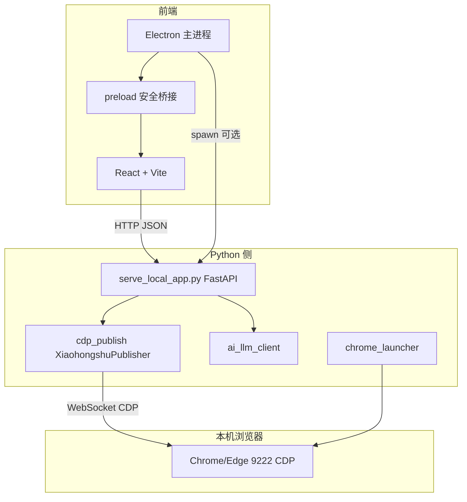

# RedBook Desktop / XiaohongshuSkills — 技术面试指南

本文面向**技术面试**：从架构、关键技术选型、数据流与实现细节说明本项目，便于你系统化表达「做了什么、为什么这样做、如何扩展」。

---

## 1. 项目一句话定位

**个人/小团队本地工具**：在**本机**用 **Chrome/Edge 远程调试（CDP）** 驱动已登录的小红书 Web 端，完成搜索、首页流、笔记详情、（可选）发布等；**FastAPI** 暴露 JSON API；**Electron + React** 提供桌面 UI；**大模型**通过 OpenAI 兼容接口做笔记分析与结构化报告。

**边界**：不爬取官方未公开 API 的「站外批量数据」；核心能力是**浏览器自动化 + 本地编排**，合规与频率需使用者自行把握。

---

## 2. 系统架构（面试常画）

**两种启动形态**：

1. **Electron 打包运行**：`python-manager.ts` 可在主进程 **spawn** `serve_local_app.py`，渲染进程通过 `getApiBase()` 访问 `http://127.0.0.1:8765`。
2. **开发 / 纯浏览器**：手动起 Python，前端 `npm run dev`，`api.ts` 默认同样指向 8765。

---

## 3. 技术栈清单（可背）

| 层级 | 技术 | 作用 |
|------|------|------|
| 桌面壳 | Electron 33+ | 窗口、菜单、系统对话框、可选拉起 Python |
| 前端 | React 18、React Router、Vite 6、Tailwind | SPA、Hash 路由、组件化 UI |
| 后端 | Python 3.10+、FastAPI、Uvicorn | REST/JSON API、CORS 给本地前端 |
| 自动化 | Chrome DevTools Protocol（CDP）、`websocket-client` | 连接调试端口，发 `Runtime.evaluate`、`Page.navigate` 等 |
| AI | OpenAI 兼容 Chat Completions、可选多模态 `image_url` | `ai_llm_client.py` 统一封装多厂商 |
| 配置 | JSON 文件（`config/`）、桌面会话 `tmp/` | 账号模板、AI Key、屏蔽词、历史目录指针 |

---

## 4. 核心实现逻辑：CDP 自动化

### 4.1 为什么用 CDP 而不是纯 HTTP 抓包？

- 小红书 Web 大量能力依赖**页面上下文、Cookie、反爬与动态脚本**；直接复刻接口成本高且易碎。
- CDP 在**真实浏览器**里执行，与人工操作同一套页面逻辑，**登录态**自然可用。

### 4.2 连接方式

- `chrome_launcher.py` 以**独立 User Data 目录**启动 Chrome/Edge，并打开 **远程调试端口**（默认 9222）。
- `XiaohongshuPublisher.connect()` 通过 `http://127.0.0.1:9222/json` 取 `webSocketDebuggerUrl`，建立 WebSocket。
- `_send(method, params)` 发 CDP 命令，**带超时**（如 15s），循环 `recv` 直到 `id` 匹配的响应（中间可能夹杂事件）。

### 4.3 典型能力如何实现（面试举例）

- **导航**：`Page.navigate` + 等待加载。
- **执行 JS**：`Runtime.evaluate`，`awaitPromise: true` 可等待 Promise；若页面卡死会触发超时。
- **搜索/Feed**：在页面内执行 JS 或触发 UI，配合 **Network 域**监听 XHR、或 **page fetch** 拿 JSON（具体以 `cdp_publish.py` 实现为准）。
- **登录**：二维码/手机号流程在**有头浏览器**中完成，Cookie 写入该 Profile。

### 4.4 风险与对策（加分回答）

- **易碎**：前端改版导致选择器/脚本失效 → 模块化封装、日志前缀 `[cdp_publish]`、超时与重试。
- **性能**：大列表、慢网 → CDP 命令超时、分页/滚动加载设计。
- **合规**：强调工具属个人效率，不鼓励突破 ToS 的批量行为。

---

## 5. 后端 API 设计（FastAPI）

### 5.1 职责划分

- **`serve_local_app.py`**：路由聚合——搜索、首页、详情、Chrome 启停、登录辅助、AI、**桌面会话与历史目录配置**等。
- **`cdp_publish.py`**：重量级 CDP 业务（`XiaohongshuPublisher` 大类，数千行量级时注意**单类职责**在面试中可谈重构方向）。
- **`ai_llm_client.py`**：读 `config/ai_settings.json`、`config/ai_presets.json`，组消息、调 HTTP、解析 JSON。

### 5.2 与前端契约

- CORS `allow_origins=["*"]`：仅适合**本机工具**，上线公网需收紧。
- 错误：`HTTPException` → 前端 `api.ts` 统一解析 `detail`。

### 5.3 桌面会话持久化（可讲「状态恢复」）

- **配置指针**：`tmp/desktop_ui_settings.json` 存用户自定义 `history_dir`；空则使用 `tmp/redbook_history/`。
- **快照文件**：`{history_dir}/redbook_session.json`，存搜索关键词与 feeds、报告历史、AI 工作台等**可序列化子集**。
- **接口**：`GET/POST /api/desktop/config`，`GET/POST /api/desktop/session`；大文件有字节上限防止误写爆盘。

---

## 6. 前端架构（React）

### 6.1 状态管理

- **`AppContext`**：全局状态（搜索、AI、报告、Chrome/登录检测等），避免切换页面丢状态。
- **持久化**：`sessionSnapshot.ts` 定义 `SessionSnapshotInput`，`buildSessionSnapshot` / `applySessionSnapshot` 与后端 JSON 对齐；挂载后拉取会话，`debounce` 写回；自定义事件 `redbook-reload-session` 在设置里改目录后**重新载入**。

### 6.2 与 Electron 协作

- **`preload.ts`** + `contextBridge`：仅暴露白名单 API（`getApiBase`、`adjustZoomDelta`、选文件夹、`shell.openPath` 等），**无** `nodeIntegration`。
- **Ctrl + 滚轮缩放**：主进程 `webContents.setZoomFactor`，与菜单「视图」缩放一致。

### 6.3 体验向特性

- 「查看原文」优先调 **`/api/browser/navigate`** 在 **CDP 当前标签**打开小红书链接，保持登录态，失败再 `window.open`。

---

## 7. AI 层（`ai_llm_client.py`）

### 7.1 设计要点

- **多厂商**：通过 `provider` + `base_url` 走 OpenAI 兼容或 Anthropic 等分支（以代码为准）。
- **预设**：`ai_presets.json` 中 `system_prompt` / `user_prompt`，占位符 `{{feeds}}`、`{{keyword}}`。
- **屏蔽词**：送模型前过滤 `title/description/author`，减少无效或敏感内容进上下文。
- **多模态**：`use_note_covers` 时拼接 `image_url` 或把封面 URL 写入文本（Claude 直连等限制）。
- **报告配图**：`generate_report` 可选 `with_illustrations`，从**笔记封面 URL 白名单**中选图 + `image_prompt_hint` 供文生图工具使用，避免模型编造外链。

### 7.2 面试可说的权衡

- **上下文长度**：`max_feeds`、报告 `max_feeds` 上限、与 `max_tokens` 配合。
- **成本与延迟**：批量大时异步队列、缓存（若未来要做）等扩展点。

---

## 8. 安全与配置（必提）

- **API Key、账号 JSON**：本地文件，**勿提交 Git**（`.gitignore` 已列）。
- **CDP 端口**：仅监听本机，不暴露公网。
- **浏览器 navigate API**：校验域名仅限 `*.xiaohongshu.com`，防 open redirect 滥用。

---

## 9. 常见面试追问与简答

**Q：如果小红书改版，哪里最先坏？**  
A：高度依赖 DOM/页面内 API 的部分在 `cdp_publish.py`；需要回归测试、日志定位、小步修补。

**Q：为什么 Electron 还要单独起 Python？**  
A：复用现有 Python CDP 与 AI 流水线，Electron 专注壳与体验；也可未来把 CDP 迁到 Node（如 puppeteer），但迁移成本大。

**Q：如何测试？**  
A：当前以冒烟为主（启动浏览器、check-login、非自动发布）；可补充 `pytest` 对 `ai_llm_client` 纯函数与 API mock。

**Q：性能瓶颈？**  
A：网络、页面渲染、模型推理；可谈分页、减少 `Runtime.evaluate` 次数、合并 CDP 调用。

**Q：你个人负责了哪块？**  
A：按你真实贡献回答：例如会话持久化、AI 预设、Electron 桥接、CDP 某条业务线等。

---

## 10. 仓库导航（快速索引）

| 路径 | 内容 |
|------|------|
| `scripts/serve_local_app.py` | FastAPI 入口、路由 |
| `scripts/cdp_publish.py` | CDP 核心自动化 |
| `scripts/chrome_launcher.py` | 调试浏览器启动 |
| `scripts/ai_llm_client.py` | LLM 与报告生成 |
| `desktop/electron/main.ts` | Electron 主进程 |
| `desktop/electron/python-manager.ts` | 子进程 Python |
| `desktop/src/store/AppContext.tsx` | 全局状态与持久化触发 |
| `desktop/src/store/sessionSnapshot.ts` | 快照序列化契约 |
| `config/ai_presets.json` | Prompt 模板 |
| `Redbook.bat` / `scripts/start_redbook_desktop.bat` | Windows 一键启动 |

---

## 11. 结语

本项目本质是 **「本地 FastAPI 编排层 + CDP 驱动真实浏览器 + React/Electron UI + 可选 LLM」** 的垂直工具链。面试时强调：**问题域（内容检索与分析）、技术选型理由、数据流、风险与扩展** 即可形成完整叙事。

如需对外投递简历，可将本文压缩为 3～5 条项目要点 + 1 条架构图（Mermaid 导出 PNG/PDF）。
